<h1>
    <p align="center">Atlas Markdown</p>
</h1>


<picture>
  <source media="(prefers-color-scheme: dark)" srcset="docs/images/obsidian.png" />
  <source media="(prefers-color-scheme: light)" srcset="docs/images/obsidian.png" />
  
</picture>


<div align="center">
    <picture>
        <source media="(prefers-color-scheme: dark)" srcset="docs/images/Apps-dark_Confluence_logo_brand_RGB.svg" height="15" />
        <source media="(prefers-color-scheme: light)" srcset="docs/images/Apps-light_Confluence_logo_brand_RGB.svg" height="15" />
        
    </picture>
    <picture>
        <source media="(prefers-color-scheme: dark)" srcset="docs/images/Apps-dark_Jira_logo_brand_RGB.svg" height="15" />
        <source media="(prefers-color-scheme: light)" srcset="docs/images/Apps-light_Jira_logo_brand_RGB.svg" height="15" />
        
    </picture>
    <picture>
        <source media="(prefers-color-scheme: dark)" srcset="docs/images/Apps-dark_Jira-Service-Management_logo_brand_RGB.svg" height="15" />
        <source media="(prefers-color-scheme: light)" srcset="docs/images/Apps-light_Jira-Service-Management_logo_brand_RGB.svg" alt="Jira Service Management" height="15" />
        
    </picture>
    <picture>
        <source media="(prefers-color-scheme: dark)" srcset="docs/images/Apps-dark_Trello_logo_brand_RGB.svg" height="15" />
        <source media="(prefers-color-scheme: light)" srcset="docs/images/Apps-light_Trello_logo_brand_RGB.svg" height="15" />
        
    </picture>
    <picture>
        <source media="(prefers-color-scheme: dark)" srcset="docs/images/Apps-dark_Bitbucket_logo_brand_RGB.svg" height="15" />
        <source media="(prefers-color-scheme: light)" srcset="docs/images/Apps-light_Bitbucket_logo_brand_RGB.svg" height="15" />
        
    </picture>
    <picture>
        <source media="(prefers-color-scheme: dark)" srcset="docs/images/Apps-dark_Statuspage_logo_brand_RGB.svg" height="15" />
        <source media="(prefers-color-scheme: light)" srcset="docs/images/Apps-light_Statuspage_logo_brand_RGB.svg" height="15" />
        
    </picture>
</div>

A robust command-line tool for transforming selected <strong><a href="https://support.atlassian.com">Atlassian online product documentation</a></strong> into a clean, organized Markdown site on your local filesystem. Built specifically for use with <strong><a href="https://obsidian.md/)">Obsidian</a></strong>, though any markdown viewer will work.

<br/>


## Features

- 🚀 **Autonomous Operation** - Set it and forget it. The script handles everything from discovery to final output
- 🔄 **Resume Capability** - Interrupt anytime and continue where you left off
- 📸 **Image Handling** - Downloads all images and updates references automatically
- 🎯 **Accurate Content Extraction** - Handles React SPAs and dynamic content with Playwright
- 📝 **Clean Markdown** - Converts HTML to linted and well-formatted Markdown
- 🛡️ **Managed Safeguards** - Rate limiting, circuit breakers, and configurable constraints

## Requirements

- Python 3.11+
- macOS (optimized for) or Linux. Windows might work :shrug:

## Quick Start

Download the [latest](https://github.com/jsade/atlas-markdown/releases/latest) release and extract it to a suitable folder.

```bash
# 1. Run the initialization script
python3 init.py

# 2. Activate the virtual environment
source venv/bin/activate

# 3. Configure settings
cp .env.example .env
# Edit .env with your preferences

# 4. Test the environment
python utils/test_environment.py

# 5. Run the script
atlas-markdown
```

## How It Works

The script operates in 7 distinct phases:

1. **Discovery** - Extracts page hierarchy from React state or sitemap
2. **Page Scraping** - Downloads pages using Playwright for JavaScript rendering
3. **Image Download** - Fetches all referenced images asynchronously
4. **Retry Failed** - Attempts to re-scrape any failed pages
5. **Index Generation** - Creates navigation index of all content
6. **Link Resolution** - Converts wiki-style links to file references
7. **Markdown Linting** - Cleans up and standardizes formatting

```mermaid
  flowchart LR
      subgraph Phase1["1 Discovery"]
          D1[React State<br/>Extraction]
          D2[Sitemap<br/>Parsing]
      end

      subgraph Phase2["2 Page Scraping"]
          PS1[Playwright<br/>Rendering]
          PS2[Content<br/>Extraction]
      end

      subgraph Phase3["3 Image Download"]
          ID1[Async<br/>Fetching]
          ID2[Path<br/>Rewriting]
      end

      subgraph Phase4["4 Retry Failed"]
          RF1[Error<br/>Detection]
          RF2[Smart<br/>Retries]
      end

      subgraph Phase5["5 Index Generation"]
          IG1[Navigation<br/>Structure]
          IG2[TOC<br/>Creation]
      end

      subgraph Phase6["6 Link Resolution"]
          LR1[Wiki-style<br/>Links]
          LR2[File<br/>References]
      end

      subgraph Phase7["7 Markdown Linting"]
          ML1[Format<br/>Cleanup]
          ML2[Standardization]
      end

      Start([🚀]) --> Phase1
      Phase1 --> Phase2
      Phase2 --> Phase3
      Phase3 --> Phase4
      Phase4 --> Phase5
      Phase5 --> Phase6
      Phase6 --> Phase7
      Phase7 --> End([✅])

      %% Styling
      classDef phaseBox fill:#030,stroke:#060,stroke-width:1px,color:#fff
      classDef innerNode fill:#020,stroke:#2c5aa0,stroke-width:1px,color:#fff,font-size:11px
      classDef startEnd fill:#2ecc71,stroke:#27ae60,stroke-width:3px,color:#fff

      class Phase1,Phase2,Phase3,Phase4,Phase5,Phase6,Phase7 phaseBox
      class D1,D2,PS1,PS2,ID1,ID2,RF1,RF2,IG1,IG2,LR1,LR2,ML1,ML2 innerNode
      class Start,End startEnd
```

<details>
<summary>Click to open a visual representation</summary>



</details>

<details>
<summary>Click to open an example site output</summary>

```plaintext
output/
├── index.md                    # Main navigation index
├── docs/                       # Documentation pages
│   ├── Getting started.md
│   ├── Administration/
│   │   ├── Overview.md
│   │   └── User management.md
│   └── ...
├── resources/                  # Resource pages (if enabled)
│   └── ...
├── images/                     # Downloaded images
│   └── [organized by page]
└── linting_report.md          # Markdown formatting report
```

</details>

### State Management

The script uses SQLite (`scraper_state.db`) to track:

- Page scraping status and metadata
- Image download progress
- Failed pages for retry
- Session information

This enables seamless resumption after interruptions.

### Markdown Linting Rules

The script includes an automatic markdown linter that fixes common formatting issues. The linter generates a report (`linting_report.md`) summarizing all fixes applied across your documentation.

<details>
<summary>Click to open list of special linting rules</summary>
<br/>
The following rules are applied during the linting phase (can be skipped with `--no-lint`):

- Content Structure
	- Remove content before H1 - Ensures documents start with a proper H1 heading
	- Fix multi-line wiki links - Consolidates wiki links that span multiple lines into single-line format
- Link Formatting
	- Convert internal links to wiki-style - Internal markdown links `[text](file.md)` become `[[file|text]]`
	- Preserve external links - HTTP/HTTPS links remain in standard markdown format `[text](url)`
- Panel Conversion
	- Panel admonitions will be transformed to Obsidian [callout](https://help.obsidian.md/callouts) format
 	- Supports types "info", "warning", "error", "note", and "success"
- Table Formatting
	- Add missing table headers - Inserts header rows for tables that lack them
	- Fix table separators - Ensures proper table formatting with separator lines
- Heading Rules
	- Enforce heading spacing - Adds blank lines before and after headings for consistency
	- Preserve heading hierarchy - Maintains proper H1-H6 structure
- Whitespace Management
	- Remove trailing whitespace - Cleans line endings
	- Reduce multiple blank lines - Replaces 3+ consecutive blank lines with 2
	- Ensure final newline - Adds newline at end of file if missing
- HTML Conversion
	- Convert inline HTML - Transforms common HTML tags to markdown:
		- `<br>` → line break
		- `<strong>`, `<b>` → `**bold**`
		- `<em>`, `<i>` → `*italic*`
		- `<code>` → `` `code` ``
- List Formatting
	- Fix list indentation - Ensures list items start at column 0
	- Remove empty lines between list items - Creates compact lists
	- Fix numbered list sequences - Renumbers lists to be consecutive (1, 2, 3...)

</details>

### Helpful Logging

- Supports various log levels (DEBUG, INFO, WARNING, ERROR)
- Timestamped log output to LOG_DIR

<details>
	<summary>Click to open a screenshot</summary>
<br/>


<br/>

</details>

## Usage

```bash
atlas-markdown <options> <arguments>
```

### Command Line Options

| Option | Short | Description | Default |
|--------|-------|-------------|---------|
| `--output` | `-o` | Output directory for documentation | `./output` |
| `--workers` | `-w` | Number of concurrent workers | `5` |
| `--delay` | `-d` | Delay between requests (seconds) | `1.5` |
| `--resume` | | Resume from previous state | `False` |
| `--dry-run` | | Preview without downloading | `False` |
| `--no-lint` | | Skip markdown linting phase | `False` |
| `--include-resources` | | Include /resources/ pages | `False` |
| `--create-redirect-stubs` | | Create stub files for redirected URLs | `False` |
| `--verbose` | `-v` | Enable verbose output | `False` |

### Configuration

The script uses environment variables for configuration. Copy `.env.example` to `.env` and adjust:

```bash
# Base URL (must be a valid Atlassian support URL)
# See .env.example for further information
BASE_URL=https://support.atlassian.com/jira-service-management-cloud/

# Output settings
OUTPUT_DIR=./output
WORKERS=5
REQUEST_DELAY=1.5

# Safety constraints
MAX_CRAWL_DEPTH=5
MAX_PAGES=1000
MAX_RUNTIME_MINUTES=120
MAX_RETRIES=3

# Domain restriction controls which URLs the script will follow
# See .env.example for further information
DOMAIN_RESTRICTION=product
```

## Troubleshooting

**Script hangs on "Initializing browser"**
- Run `playwright install chromium` to ensure browser is installed

**"Too many requests" errors**
- Increase `REQUEST_DELAY` in `.env`
- Reduce `WORKERS` count

**Out of memory errors**
- Reduce `WORKERS` count
- Enable verbose mode to identify memory-heavy pages

**Resume not working**
- Ensure `scraper_state.db` exists and is not corrupted
- Check file permissions on output directory

## Responsible Use

This tool is designed for legitimate documentation archival and offline access. To use it responsibly:

1. **Respect Rate Limits** - The default 1.5 second delay between requests is configured to be respectful
2. **Check robots.txt** - Atlassian's robots.txt currently allows scraping of documentation pages
3. **Personal Use** - Use downloaded content for personal reference, not redistribution

## License

This project is licensed under the GNU General Public License v3.0 - see the [LICENSE](LICENSE) file for details.

## Disclaimer

This project is an independent open-source tool and is not affiliated with, endorsed by, or sponsored by Atlassian Corporation Pty Ltd.

<details>
<summary>Click to open full disclaimer</summary>
<br/>

_All Atlassian product names, logos, and brands mentioned in this repository (including but not limited to Jira, Confluence, Bitbucket, Trello, and Statuspage) are the property of Atlassian Corporation Pty Ltd. All product and company names are trademarks™ or registered® trademarks of their respective holders. Use of them does not imply any affiliation with or endorsement by them._

_This tool is designed for personal use to create offline copies of publicly available documentation. Users are responsible for complying with Atlassian's Terms of Service and any applicable usage policies when accessing their documentation._

</details>
