# Atlassian Docs to Markdown

A robust command-line tool that downloads selected Atlassian product documentation from https://support.atlassian.com and transforms it to a clean, organized Markdown folder on your local filesystem. Built specifically to be used with [Obsidian](https://obsidian.md/) though any markdown viewer should work.

Supports the following documentation sites:

- [Jira Software Cloud](https://support.atlassian.com/jira-software-cloud)
- [Jira Work Management](https://support.atlassian.com/jira-work-management)

- [Jira Service Management Cloud](https://support.atlassian.com/jira-service-management-cloud)
- [Confluence Cloud](https://support.atlassian.com/confluence-cloud)
- [Trello](https://support.atlassian.com/trello)
- [Bitbucket Cloud](https://support.atlassian.com/bitbucket-cloud)
- [Statuspoge](https://support.atlassian.com/statuspage)


## Features

- 🚀 **Autonomous Operation** - Set it and forget it. The scraper handles everything from discovery to final output
- 🔄 **Resume Capability** - Interrupt anytime and continue where you left off
- 📸 **Image Handling** - Downloads all images and updates references automatically
- 🎯 **Accurate Content Extraction** - Handles React SPAs and dynamic content with Playwright
- 📝 **Clean Markdown** - Converts HTML to linted and well-formatted Markdown
- 🛡️ **Constrained** - Rate limiting, circuit breakers, and configurable constraints


## Quick Start

```bash
# 1. Run the initialization script
python3 init.py

# 2. Activate the virtual environment
source venv/bin/activate

# 3. Configure settings (optional)
cp .env.example .env
# Edit .env with your preferences

# 4. Run the scraper
./run.sh

# 5. Test the environment (optional)
python utils/test_environment.py
```

## Usage

### Basic Commands

```bash
# Scrape with default settings
./run.sh

# Specify output directory
./run.sh --output ./atlassian-docs

# Resume from previous session
./run.sh --resume

# Preview what would be scraped
./run.sh --dry-run

# Skip markdown linting phase
./run.sh --no-lint
```

### Command Line Options

| Option | Short | Description | Default |
|--------|-------|-------------|---------|
| `--output` | `-o` | Output directory for documentation | `./output` |
| `--workers` | `-w` | Number of concurrent workers | `5` |
| `--delay` | `-d` | Delay between requests (seconds) | `1.5` |
| `--resume` | | Resume from previous state | `False` |
| `--dry-run` | | Preview without downloading | `False` |
| `--no-lint` | | Skip markdown linting phase | `False` |
| `--include-resources` | | Include /resources/ pages | `False` |
| `--create-redirect-stubs` | | Create stub files for redirected URLs | `False` |
| `--verbose` | `-v` | Enable verbose output | `False` |

## Configuration

The scraper uses environment variables for configuration. Copy `.env.example` to `.env` and adjust:

```bash
# Base URL (must be a valid Atlassian support URL)
# See .env.example for further information
BASE_URL=https://support.atlassian.com/jira-service-management-cloud/

# Output settings
OUTPUT_DIR=./output
WORKERS=5
REQUEST_DELAY=1.5

# Safety constraints
MAX_CRAWL_DEPTH=5
MAX_PAGES=1000
MAX_RUNTIME_MINUTES=120
MAX_RETRIES=3

# Domain restriction controls which URLs the scraper will follow
# See .env.example for further information
DOMAIN_RESTRICTION=product
```

## How It Works

The scraper operates in 7 phases:

1. **Discovery** - Extracts page hierarchy from React state or sitemap
2. **Page Scraping** - Downloads pages using Playwright for JavaScript rendering
3. **Image Download** - Fetches all referenced images asynchronously
4. **Retry Failed** - Attempts to re-scrape any failed pages
5. **Index Generation** - Creates navigation index of all content
6. **Link Resolution** - Converts wiki-style links to file references
7. **Markdown Linting** - Cleans up and standardizes formatting

```mermaid
  flowchart TD
      Start([🚀 Start Scraping]) --> D[📊 Discovery]
      D --> |Extract hierarchy| PS[📄 Page Scraping]
      PS --> |Download content| ID[🖼️ Image Download]
      ID --> |Fetch assets| RF[🔄 Retry Failed]
      RF --> |Re-attempt errors| IG[📑 Index Generation]
      IG --> |Create navigation| LR[🔗 Link Resolution]
      LR --> |Convert references| ML[✨ Markdown Linting]
      ML --> End([✅ Complete])

      %% Styling
      classDef phaseStyle fill:#4a90e2,stroke:#2c5aa0,stroke-width:2px,color:#fff,font-weight:bold
      classDef startEnd fill:#2ecc71,stroke:#27ae60,stroke-width:2px,color:#fff,font-weight:bold

      class D,PS,ID,RF,IG,LR,ML phaseStyle
      class Start,End startEnd

      %% Add subtle descriptions
      D:::description
      PS:::description
      ID:::description
      RF:::description
      IG:::description
      LR:::description
      ML:::description
```




```mermaid
  flowchart LR
      subgraph Phase1[" 📊 Discovery "]
          D1[React State<br/>Extraction]
          D2[Sitemap<br/>Parsing]
      end

      subgraph Phase2[" 📄 Page Scraping "]
          PS1[Playwright<br/>Rendering]
          PS2[Content<br/>Extraction]
      end

      subgraph Phase3[" 🖼️ Image Download "]
          ID1[Async<br/>Fetching]
          ID2[Path<br/>Rewriting]
      end

      subgraph Phase4[" 🔄 Retry Failed "]
          RF1[Error<br/>Detection]
          RF2[Smart<br/>Retries]
      end

      subgraph Phase5[" 📑 Index Generation "]
          IG1[Navigation<br/>Structure]
          IG2[TOC<br/>Creation]
      end

      subgraph Phase6[" 🔗 Link Resolution "]
          LR1[Wiki-style<br/>Links]
          LR2[File<br/>References]
      end

      subgraph Phase7[" ✨ Markdown Linting "]
          ML1[Format<br/>Cleanup]
          ML2[Standardization]
      end

      Start([🚀]) --> Phase1
      Phase1 --> Phase2
      Phase2 --> Phase3
      Phase3 --> Phase4
      Phase4 --> Phase5
      Phase5 --> Phase6
      Phase6 --> Phase7
      Phase7 --> End([✅])

      %% Styling
      classDef phaseBox fill:#e8f4f8,stroke:#4a90e2,stroke-width:2px,color:#2c5aa0
      classDef innerNode fill:#4a90e2,stroke:#2c5aa0,stroke-width:1px,color:#fff,font-size:11px
      classDef startEnd fill:#2ecc71,stroke:#27ae60,stroke-width:3px,color:#fff

      class Phase1,Phase2,Phase3,Phase4,Phase5,Phase6,Phase7 phaseBox
      class D1,D2,PS1,PS2,ID1,ID2,RF1,RF2,IG1,IG2,LR1,LR2,ML1,ML2 innerNode
      class Start,End startEnd
````


## Output Structure

```
output/
├── index.md                    # Main navigation index
├── docs/                       # Documentation pages
│   ├── Getting started.md
│   ├── Administration/
│   │   ├── Overview.md
│   │   └── User management.md
│   └── ...
├── resources/                  # Resource pages (if enabled)
│   └── ...
├── images/                     # Downloaded images
│   └── [organized by page]
└── linting_report.md          # Markdown formatting report
```

## State Management

The scraper uses SQLite (`scraper_state.db`) to track:
- Page scraping status and metadata
- Image download progress
- Failed pages for retry
- Session information

This enables seamless resumption after interruptions.

## Error Handling

- **Rate Limiting** - Token bucket algorithm prevents server overload
- **Circuit Breaker** - Stops after too many consecutive failures
- **Exponential Backoff** - Smart retry logic for transient errors
- **Health Monitoring** - Checks system resources during operation
- **Graceful Shutdown** - Saves state on Ctrl+C

## Development

### Manual Setup

```bash
# Create virtual environment
python3 -m venv venv
source venv/bin/activate

# Install dependencies
pip install -r requirements.txt

# Install Playwright browser
playwright install chromium
```

### Running Tests

```bash
# Run all tests
pytest tests/

# Run with coverage
pytest --cov=src tests/

# Run specific test
pytest tests/test_content_parser.py -v
```

### Code Quality

```bash
# Linting
ruff check .
black --check .

# Auto-format
black .
ruff check . --fix
```

## Requirements

- Python 3.8+
- macOS (optimized for) or Linux
- 2GB+ free disk space for docs and images
- Internet connection with access to Atlassian domains

### Notes on Markdown Flavors

- All panels (info, warning, note, error) are converted to an Obsidian [callout](https://help.obsidian.md/callouts) format.
- Internal (local) links will be rendered as wikilinks, external links will use markdown link syntax.

## Troubleshooting

**Scraper hangs on "Initializing browser"**
- Run `playwright install chromium` to ensure browser is installed

**"Too many requests" errors**
- Increase `REQUEST_DELAY` in `.env`
- Reduce `WORKERS` count

**Out of memory errors**
- Reduce `WORKERS` count
- Enable verbose mode to identify memory-heavy pages

**Resume not working**
- Ensure `scraper_state.db` exists and is not corrupted
- Check file permissions on output directory

## Responsible Use

This tool is designed for legitimate documentation archival and offline access. To use it responsibly:

1. **Respect Rate Limits** - The default 1.5 second delay between requests is configured to be respectful
2. **Check robots.txt** - Atlassian's robots.txt currently allows scraping of documentation pages
3. **Personal Use** - Use downloaded content for personal reference, not redistribution

## License

This project is licensed under the GNU General Public License v3.0 - see the LICENSE file for details.
