<h1>
    <p align="center">Atlas Markdown</p>
</h1>

<picture>
  <source media="(prefers-color-scheme: dark)" srcset="docs/images/obsidian.png" />
  <source media="(prefers-color-scheme: light)" srcset="docs/images/obsidian.png" />
  
</picture>


<div align="center" style="margin-bottom:10px">
    <picture style="margin-right:5px">
        <source media="(prefers-color-scheme: dark)" srcset="docs/images/Apps-dark_Confluence_logo_brand_RGB.svg" height="15" />
        <source media="(prefers-color-scheme: light)" srcset="docs/images/Apps-light_Confluence_Logo_brand_RGB.svg" height="15" />
        
    </picture>
    <picture style="margin-right:5px">
        <source media="(prefers-color-scheme: dark)" srcset="docs/images/Apps-dark_Jira_logo_brand_RGB.svg" height="15" />
        <source media="(prefers-color-scheme: light)" srcset="docs/images/Apps-light_Jira_Logo_brand_RGB.svg" height="15" />
        
    </picture>
    <picture style="margin-right:5px">
        <source media="(prefers-color-scheme: dark)" srcset="docs/images/Apps-dark_Jira-Service-Management_logo_brand_RGB.svg" height="15" />
        <source media="(prefers-color-scheme: light)" srcset="docs/images/Apps-light_Jira-Service-Management_Logo_brand_RGB.svg" alt="Jira Service Management" height="15" />
        
    </picture>
    <picture style="margin-right:5px">
        <source media="(prefers-color-scheme: dark)" srcset="docs/images/Apps-dark_Trello_logo_brand_RGB.svg" height="15" />
        <source media="(prefers-color-scheme: light)" srcset="docs/images/Apps-light_Trello_Logo_brand_RGB.svg" height="15" />
        
    </picture>
    <picture style="margin-right:5px">
        <source media="(prefers-color-scheme: dark)" srcset="docs/images/Apps-dark_Bitbucket_logo_brand_RGB.svg" height="15" />
        <source media="(prefers-color-scheme: light)" srcset="docs/images/Apps-light_Bitbucket_Logo_brand_RGB.svg" height="15" />
        
    </picture>
    <picture style="margin-right:5px">
        <source media="(prefers-color-scheme: dark)" srcset="docs/images/Apps-dark_Statuspage_logo_brand_RGB.svg" height="15" />
        <source media="(prefers-color-scheme: light)" srcset="docs/images/Apps-light_Statuspage_logo_brand_RGB.svg" height="15" />
        
    </picture>
</div>


⭐ A robust command-line tool for transforming [Atlassian online product documentation](https://support.atlassian.com) into a clean, organized Markdown site on your local filesystem.

Built specifically for use with [Obsidian](https://obsidian.md/), though any markdown viewer will work.

## Features

- **Autonomous Operation** - Set it and forget it. The script handles everything from discovery to final output
- **Resume Capability** - Interrupt anytime and continue where you left off
- **Image Handling** - Downloads all images and updates references automatically
- **Accurate Content Extraction** - Handles React SPAs and dynamic content with Playwright
- **Clean Markdown** - Converts HTML to linted and well-formatted Markdown
- **Managed Safeguards** - Rate limiting, circuit breakers, and configurable constraints
- **Auto-Tagging** - Automatically generates contextual tags using semantic content analysis for better organization in Obsidian

## Requirements

- Python 3.11+
- macOS (optimized for) or Linux. Windows might work :shrug:

## Quick Start

> [!CAUTION]
> Pre-release. Iterative changes to be expected.

Download the wheel file from the [latest release](https://github.com/jsade/atlas-markdown/releases/latest) (e.g., `atlas_markdown-0.1.1-py3-none-any.whl`).

```bash
# 1. Create and activate a virtual environment
python3 -m venv venv
source venv/bin/activate

# 2. Install from wheel
pip install atlas_markdown-*.whl

# 3. Install browser for web scraping
playwright install chromium

# 4. Run the tool (choose one of the following methods):

# Option A: Using command-line argument
atlas-markdown -u "https://support.atlassian.com/confluence-cloud"

# Option B: Using environment variable
export ATLAS_MD_BASE_URL="https://support.atlassian.com/confluence-cloud"
atlas-markdown

# Valid product endpoints:
#   - jira-service-management-cloud
#   - jira-software-cloud
#   - confluence-cloud
#   - jira-work-management
#   - trello
#   - bitbucket-cloud
#   - statuspage
```

For development installation options, see [CONTRIBUTING.md](CONTRIBUTING.md#installation-options).

## How It Works

The script operates in 7 distinct phases:

1. **Discovery** - Extracts page hierarchy from React state or sitemap
2. **Page Fetching** - Downloads pages using Playwright for JavaScript rendering
3. **Image Download** - Fetches all referenced images asynchronously
4. **Retry Failed** - Attempts to re-fetch any failed pages
5. **Index Generation** - Creates navigation index of all content
6. **Link Resolution** - Converts wiki-style links to file references
7. **Markdown Linting** - Cleans up and standardizes formatting

```mermaid
  flowchart LR
      subgraph Phase1["1 Discovery"]
          D1[React State<br/>Extraction]
          D2[Sitemap<br/>Parsing]
      end

      subgraph Phase2["2 Page Scraping"]
          PS1[Playwright<br/>Rendering]
          PS2[Content<br/>Extraction]
      end

      subgraph Phase3["3 Image Download"]
          ID1[Async<br/>Fetching]
          ID2[Path<br/>Rewriting]
      end

      subgraph Phase4["4 Retry Failed"]
          RF1[Error<br/>Detection]
          RF2[Smart<br/>Retries]
      end

      subgraph Phase5["5 Index Generation"]
          IG1[Navigation<br/>Structure]
          IG2[TOC<br/>Creation]
      end

      subgraph Phase6["6 Link Resolution"]
          LR1[Wiki-style<br/>Links]
          LR2[File<br/>References]
      end

      subgraph Phase7["7 Markdown Linting"]
          ML1[Format<br/>Cleanup]
          ML2[Standardization]
      end

      Start([🚀]) --> Phase1
      Phase1 --> Phase2
      Phase2 --> Phase3
      Phase3 --> Phase4
      Phase4 --> Phase5
      Phase5 --> Phase6
      Phase6 --> Phase7
      Phase7 --> End([✅])

      %% Styling
      classDef phaseBox fill:#030,stroke:#060,stroke-width:1px,color:#fff
      classDef innerNode fill:#020,stroke:#2c5aa0,stroke-width:1px,color:#fff,font-size:11px
      classDef startEnd fill:#2ecc71,stroke:#27ae60,stroke-width:3px,color:#fff

      class Phase1,Phase2,Phase3,Phase4,Phase5,Phase6,Phase7 phaseBox
      class D1,D2,PS1,PS2,ID1,ID2,RF1,RF2,IG1,IG2,LR1,LR2,ML1,ML2 innerNode
      class Start,End startEnd
```

<details>
<summary>Click to open a visual representation</summary>



</details>

<details>
<summary>Click to open an example site output</summary>

```plaintext
output/
├── index.md                    # Main navigation index
├── docs/                       # Documentation pages
│   ├── Getting started.md
│   ├── Administration/
│   │   ├── Overview.md
│   │   └── User management.md
│   └── ...
├── resources/                  # Resource pages (if enabled)
│   └── ...
├── images/                     # Downloaded images
│   └── [organized by page]
└── linting_report.md          # Markdown formatting report
```

</details>

### Auto-Tagging

Each generated markdown file includes enhanced frontmatter with automatically generated tags based on the page's hierarchical position in the documentation. This helps with organization and navigation in tools like Obsidian.

Example frontmatter:
```yaml
---
url: https://support.atlassian.com/jira-service-management-cloud/docs/manage-users/
scrape_date: 2025-01-25T10:30:00
tags:
  - jira-service-management-cloud
  - user-management
atlas_md_version: 0.4.0
atlas_md_url: https://github.com/jsade/atlas-markdown
atlas_md_product: jira-service-management-cloud
atlas_md_category: Administration
atlas_md_section: User Management
---
```

The auto-tagging feature:
- Intelligently categorizes pages based on content (e.g., user-management, api, security, troubleshooting)
- Includes the product name as the first tag
- Generates 2-3 focused tags rather than long page slugs
- Can be disabled by setting `ATLAS_MD_DISABLE_TAGS=true`
- Atlas Markdown metadata (`atlas_md_*` fields) are always included regardless of tag settings

Common tag categories:
- `getting-started` - Overview and introduction pages
- `administration` - Configuration and settings pages
- `user-management` - User, team, and permission pages
- `api` - API reference and integration pages
- `security` - Authentication and security pages
- `automation` - Workflow and automation pages
- `troubleshooting` - Error and problem-solving pages

### State Management

The script uses SQLite to track:

- Page fetching status and metadata
- Image download progress
- Failed pages for retry
- Session information

This enables seamless resumption after interruptions.

### Markdown Linting Rules

The script includes an automatic markdown linter that fixes common formatting issues. The linter generates a report (`linting_report.md`) summarizing all fixes applied across your documentation.

<details>
<summary>Click to open list of special linting rules</summary>
<br/>
The following rules are applied during the linting phase (can be skipped with `--no-lint`):

- Content Structure
	- Remove content before H1 - Ensures documents start with a proper H1 heading
	- Fix multi-line wiki links - Consolidates wiki links that span multiple lines into single-line format
- Link Formatting
	- Convert internal links to wiki-style - Internal markdown links `[text](file.md)` become `[[file|text]]`
	- Preserve external links - HTTP/HTTPS links remain in standard markdown format `[text](url)`
- Panel Conversion
	- Panel admonitions will be transformed to Obsidian [callout](https://help.obsidian.md/callouts) format
 	- Supports types "info", "warning", "error", "note", and "success"
- Table Formatting
	- Add missing table headers - Inserts header rows for tables that lack them
	- Fix table separators - Ensures proper table formatting with separator lines
- Heading Rules
	- Enforce heading spacing - Adds blank lines before and after headings for consistency
	- Preserve heading hierarchy - Maintains proper H1-H6 structure
- Whitespace Management
	- Remove trailing whitespace - Cleans line endings
	- Reduce multiple blank lines - Replaces 3+ consecutive blank lines with 2
	- Ensure final newline - Adds newline at end of file if missing
- HTML Conversion
	- Convert inline HTML - Transforms common HTML tags to markdown:
		- `<br>` → line break
		- `<strong>`, `<b>` → `**bold**`
		- `<em>`, `<i>` → `*italic*`
		- `<code>` → `` `code` ``
- List Formatting
	- Fix list indentation - Ensures list items start at column 0
	- Remove empty lines between list items - Creates compact lists
	- Fix numbered list sequences - Renumbers lists to be consecutive (1, 2, 3...)

</details>

### Helpful Logging

- Supports various log levels (DEBUG, INFO, WARNING, ERROR)
- Timestamped log output to LOG_DIR

<details>
	<summary>Click to open a screenshot</summary>
<br/>


<br/>

</details>

## Usage

```bash
atlas-markdown <options> <arguments>
```

### Command Line Options

| Option | Short | Description | Default |
|--------|-------|-------------|---------|
| `--output` | `-o` | Output directory for documentation | `./output` |
| `--workers` | `-w` | Number of concurrent workers | `5` |
| `--delay` | `-d` | Delay between requests (seconds) | `1.5` |
| `--base-url` | `-u` | Base URL for documentation (overrides env var) | From `ATLAS_MD_BASE_URL` |
| `--resume` | | Resume from previous state | `False` |
| `--dry-run` | | Preview without downloading | `False` |
| `--no-lint` | | Skip markdown linting phase | `False` |
| `--exclude-resources` | | Exclude `/resources/` pages (only fetch `/docs/`) | `False` |
| `--create-redirect-stubs` | | Create stub files for redirected URLs | `False` |
| `--no-h1-headings` | | Remove H1 headings from markdown output | `False` |
| `--verbose` | `-V` | Enable verbose output | `False` |
| `--version` | `-v` | Print version and exit |  |


### Configuration

The script uses environment variables for configuration. All variables should be prefixed with `ATLAS_MD_` to avoid conflicts with other applications.

Add these to your shell profile (`~/.zshrc`, `~/.bashrc`, etc.):

```bash
# REQUIRED: Base URL for the documentation to fetch
# Must start with "https://support.atlassian.com/" and include a specific product endpoint
export ATLAS_MD_BASE_URL="https://support.atlassian.com/confluence-cloud"

# Optional: Override default settings as needed
export ATLAS_MD_OUTPUT_DIR="./output"    # Where to save documentation
export ATLAS_MD_WORKERS="5"              # Number of concurrent fetchers
export ATLAS_MD_REQUEST_DELAY="1.5"      # Seconds between requests
```

After adding these variables, reload your shell configuration:
```bash
source ~/.zshrc  # or ~/.bashrc
```

#### Environment Variable Reference

| Variable | Description | Default | Valid Values |
|----------|-------------|---------|-------------|
| **Required Configuration** |
| `ATLAS_MD_BASE_URL` | The Atlassian documentation URL to fetch. Must include a specific product endpoint. | **Required - No default** | `https://support.atlassian.com/{product}` |
| **Output Directory** |
| `ATLAS_MD_OUTPUT_DIR` | Directory where the fetched documentation will be saved | `./output` | Any valid directory path. |
| **Performance Settings** |
| `ATLAS_MD_WORKERS` | Number of concurrent scraping workers | `5` | `1-50` (higher = faster but more resource intensive) |
| `ATLAS_MD_REQUEST_DELAY` | Delay between requests in seconds | `1.5` | `0.1-60` (lower = faster but may trigger rate limits) |
| `ATLAS_MD_USER_AGENT` | User agent string for HTTP requests | Mozilla/5.0... | Any valid user agent string |
| **Logging Configuration** |
| `ATLAS_MD_LOG_LEVEL` | Logging verbosity level | `INFO` | `DEBUG`, `INFO`, `WARNING`, `ERROR`, `CRITICAL` |
| `ATLAS_MD_LOG_ENABLED` | Enable file logging | `false` | `true`, `false` |
| `ATLAS_MD_LOG_DIR` | Directory for log files | `logs/` | Any valid directory path |
| **Safety Constraints** |
| `ATLAS_MD_MAX_CRAWL_DEPTH` | Maximum depth to follow links from entry point | `5` | `0-10` (0 = unlimited, not recommended) |
| `ATLAS_MD_MAX_PAGES` | Maximum total pages to fetch | `1500` | `0+` (0 = unlimited, use with caution) |
| `ATLAS_MD_MAX_RUNTIME_MINUTES` | Maximum runtime in minutes before stopping | `120` | `0+` (0 = unlimited) |
| `ATLAS_MD_MAX_FILE_SIZE_MB` | Skip files larger than this size | `50` | `1+` MB |
| `ATLAS_MD_DOMAIN_RESTRICTION` | Control which URLs to follow | `product` | See below |
| `ATLAS_MD_MAX_RETRIES` | Maximum retry attempts for failed pages | `3` | `0-10` |
| `ATLAS_MD_MAX_CONSECUTIVE_FAILURES` | Stop after this many consecutive failures | `20` | `5+` |
| `ATLAS_MD_DRY_RUN_DEFAULT` | Enable dry run mode by default | `false` | `true`, `false` |
| **Content Processing** |
| `ATLAS_MD_NO_H1_HEADINGS` | Remove H1 headings from output | `false` | `true`, `false` |
| `ATLAS_MD_DISABLE_TAGS` | Disable automatic tag generation | `false` | `true`, `false` |
| `ATLAS_MD_ENABLE_CONTENT_ANALYSIS` | Enable semantic content analysis for enhanced tagging | `true` | `true`, `false` |
| `ATLAS_MD_MAX_TAGS` | Maximum tags per page | `10` | `1-20` |
| `ATLAS_MD_MIN_TERM_FREQUENCY` | Minimum occurrences for technical terms | `3` | `1-10` |
| `ATLAS_MD_TECHNICAL_PATTERNS` | Enable technical pattern detection | `true` | `true`, `false` |

#### Domain Restriction Modes

- **`product`** (default) - Only fetch URLs under your specific product. For example, if `ATLAS_MD_BASE_URL` is set to `.../jira-service-management-cloud/`, only URLs starting with that path will be fetched.
- **`any-atlassian`** - Allow fetching any `support.atlassian.com` URL. Warning: This may result in fetching documentation from other Atlassian products.
- **`off`** - No domain restrictions (not recommended). The crawler could potentially follow links to external sites.

#### Supported Atlassian Products

- `jira-service-management-cloud`
- `jira-software-cloud`
- `confluence-cloud`
- `jira-work-management`
- `trello`
- `bitbucket-cloud`
- `statuspage`

### Usage Examples

```bash
# Fetch Confluence documentation using command-line option
atlas-markdown -u "https://support.atlassian.com/confluence-cloud" -o ./confluence-docs

# Fetch Jira documentation with custom settings
atlas-markdown -u "https://support.atlassian.com/jira-software-cloud" \
  --output ./jira-docs \
  --workers 3 \
  --delay 2.0

# Resume interrupted fetch
atlas-markdown --resume

# Dry run to preview what would be fetched
atlas-markdown -u "https://support.atlassian.com/trello" --dry-run

# Using environment variable instead of command-line option
export ATLAS_MD_BASE_URL="https://support.atlassian.com/bitbucket-cloud"
atlas-markdown --output ./bitbucket-docs
```

## Troubleshooting

**Script hangs on "Initializing browser"**
- Run `playwright install chromium` to ensure browser is installed

**"Too many requests" errors**
- Increase `ATLAS_MD_REQUEST_DELAY` environment variable
- Reduce `ATLAS_MD_WORKERS` count

**Out of memory errors**
- Reduce `ATLAS_MD_WORKERS` count
- Enable verbose mode to identify memory-heavy pages

**Resume not working**
- Ensure `atlas_md_fetch_state.db` exists and is not corrupted
- Check file permissions on output directory

## Responsible Use

This tool is designed for legitimate documentation archival and offline access. To use it responsibly:

1. **Respect Rate Limits** - The default 1.5 second delay between requests is configured to be respectful
2. **Check robots.txt** - Atlassian's robots.txt currently allows scraping of documentation pages
3. **Personal Use** - Use downloaded content for personal reference, not redistribution

## License

This project is licensed under the GNU General Public License v3.0 - see the [LICENSE](LICENSE) file for details.

## Disclaimer

This project is an independent open-source tool and is not affiliated with, endorsed by, or sponsored by Atlassian Corporation Pty Ltd.

<details>
<summary>Click to open full disclaimer</summary>
<br/>

_All Atlassian product names, logos, and brands mentioned in this repository (including but not limited to Jira, Confluence, Bitbucket, Trello, and Statuspage) are the property of Atlassian Corporation Pty Ltd. All product and company names are trademarks™ or registered® trademarks of their respective holders. Use of them does not imply any affiliation with or endorsement by them._

_This tool is designed for personal use to create offline copies of publicly available documentation. Users are responsible for complying with Atlassian's Terms of Service and any applicable usage policies when accessing their documentation._

</details>
